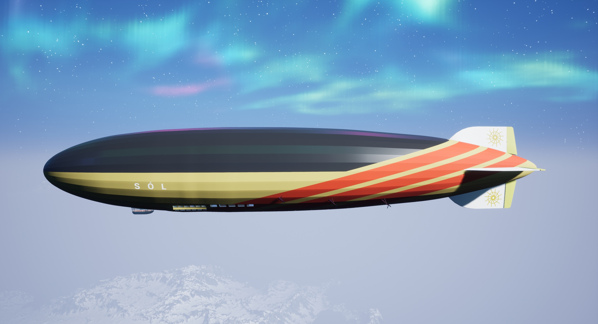

# mamf45-project
This is a project in the course MAMF45 (Virtual Reality in Theory and Practice) at LTH.

Come aboard the airship **[Sól](https://en.wikipedia.org/wiki/S%C3%B3l_(sun))** (named after a Norse sun goddess, as the fictional ship is envisioned to be solar-powered), a majestic cruise vehicle in the style and size of the passenger zeppelins of old. The ship's outer dimensions equal those of the ill-fated Hindenburg (though lifted by wholly inert helium rather than flammable hydrogen gas, of course). The ship can both be piloted and freely explored, in an attempt to let the player experience the true scale of the largest flying craft humanity has ever constructed.
As an airship of the bright future, Sól includes a three-dimensional holographic map which can be used to find one's way around the ship.

The program can be run in either desktop or VR mode; to properly run in VR mode, start the program with the command-line argument `-vr`. To start in desktop, run the program without any arguments, potentially using the shortcut `Shift + Tab` after starting to switch away from automatically enabled VR camera controls if needed.

## VR
* Only two buttons used (teleportation in front, general control trigger on the back).
* Move the controller while holding the trigger button to drag a virtual control.
* Both virtual controllers include armbands to (de)activate the hologram; use the right hand controller to trigger the armband following the left hand controller (or vice versa).

## Desktop
* Drag the mouse while holding the left mouse button to drag the virtual controls.
* Press H (or left click on the faint holographic ring following the center of the player) to (de)activate the hologram.

## Download link for final project
[Version 20180522 003](https://drive.google.com/uc?export=download&id=1Y5sU1HhMNgSfr988RIcj7Gc50MToo4Fx)
[Version 20180522 002](https://drive.google.com/uc?export=download&id=1PKOL1zBOppF6g2XvNXNLi2PnLvfw73vB)
[Version 20180520 001](https://drive.google.com/uc?export=download&id=1cpor_1xbUVkMoLBHyfMOzbuxskCuQObm)

## Group members
* Dennis Jin
* Daniel Myhrman
* Johan Pettersson
* Andy Tang
